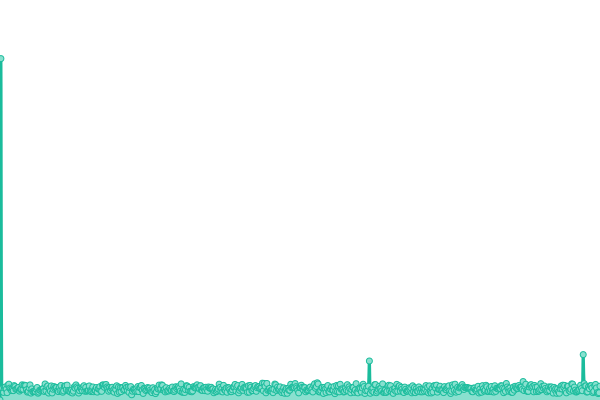
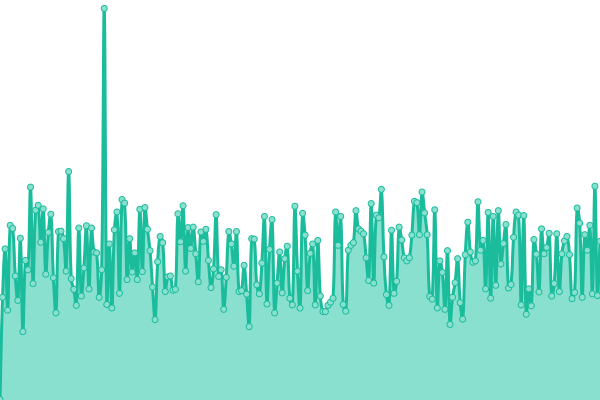
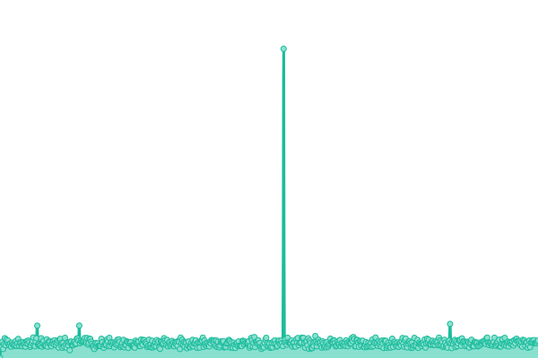
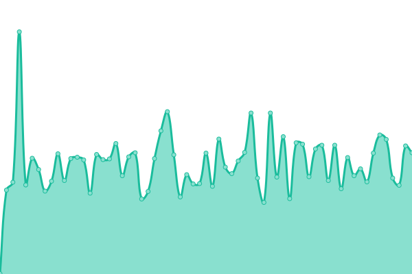

# [📈 Live Status](https://health.analmusk.com): <!--live status--> **🟩 All systems operational**

This repository contains the open-source uptime monitor and status page for [Anal Musk](https://health.analmusk.com)

<!--start: status pages-->
<!-- This summary is generated by Upptime (https://github.com/upptime/upptime) -->
<!-- Do not edit this manually, your changes will be overwritten -->
<!-- prettier-ignore -->
| URL | Status | History | Response Time | Uptime |
| --- | ------ | ------- | ------------- | ------ |
|  [Anal Site](https://analmusk.com) | 🟩 Up | [anal-site.yml](https://github.com/analmusk/health/commits/HEAD/history/anal-site.yml) | 

 367ms
     
 | 

<a href="https://health.analmusk.com/history/anal-site">100.00%</a>
    

|  [Alan Site](https://alanmusk.com) | 🟩 Up | [alan-site.yml](https://github.com/analmusk/health/commits/HEAD/history/alan-site.yml) | 

 362ms
     
 | 

<a href="https://health.analmusk.com/history/alan-site">100.00%</a>
    

|  [Anal API](https://api.analmusk.com/api-docs/) | 🟩 Up | [anal-api.yml](https://github.com/analmusk/health/commits/HEAD/history/anal-api.yml) | 

 278ms
     
 | 

<a href="https://health.analmusk.com/history/anal-api">100.00%</a>
    

|  [Anal CDN](https://cdn.analmusk.com) | 🟩 Up | [anal-cdn.yml](https://github.com/analmusk/health/commits/HEAD/history/anal-cdn.yml) | 

 437ms
     
 | 

<a href="https://health.analmusk.com/history/anal-cdn">100.00%</a>
    

<!--end: status pages-->

[**Visit our status website →**](https://health.analmusk.com)

## 📄 License

- Code: [MIT](./LICENSE) © [Anal Musk](https://health.analmusk.com)
- Data in the `./history` directory: [Open Database License](https://opendatacommons.org/licenses/odbl/1-0/)
